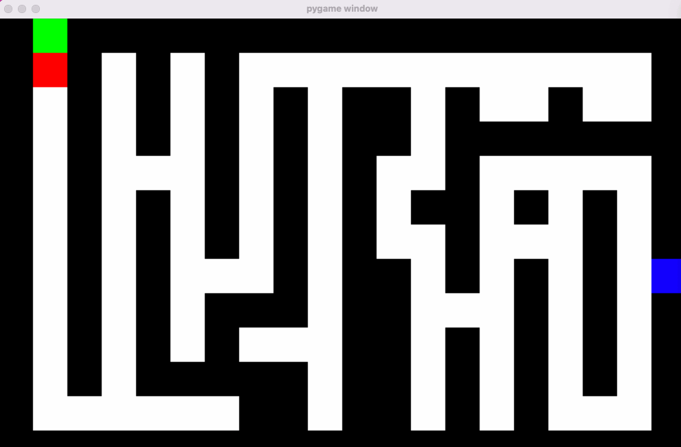

# 8 bit CPU emulator

This project emulates an 8 bit CPU using simulated logic gates. All the operations and control flow are based on the underlying properties of the logic gates, and changing their operation leads to corresponding changes in function.  
 
 
 
# Usage  
```bash
git clone https://github.com/BasedLukas/cpu_simulator.git
pip install pygame
cd cpu_simulator
python maze_run.py
```
The cpu and assembler themselves have no dependencies. The maze requires pygame.
Watch the cpu control a robot in a maze. The (red) robot sees one square ahead (green), and is controlled by the `robot.asm` program.  

To interact directly with the cpu and write your own assembly code:
```bash
cd web
pip install wheel
python setup.py bdist_wheel
python -m http.server
```
Visit localhost:8000 to view code in browser. Can you solve the maze? 

  

  
# Design

There are 6 registers, an input and an output. There is an ALU that can ADD, SUB, AND, OR. You can also perform comparisons.

#### Code
Move a value into reg0.
```
0  # move 0 into reg0   
36 # move 36 into reg0
```   
Note that the 2 MSB must always be false, so the max value is 63

Arithmetic  
The operands are always reg1 and reg2 and the output is stored in reg3.
```
add  
or
and
sub
```
Copy
```
copy 0 6 # copy from reg0 to output
copy 5 3 # copy from reg5 to reg3
```
Eval  
Evaluates reg3 against a condition, if true sets the program counter to the value in reg0.
USES SIGNED NUMBERS
```
eval always
eval never
eval =
eval !=
eval < 
eval <=
eval >
eval >=
```  
Labels can be defined to be used as jumping points.    
```
label start
# read from input into reg1
copy 6 1
# add reg 1 and 2
add
#copy result into reg2
copy 3 2

# loop so long as we are not negative
start
eval >=

# when we overflow print result to output
copy 3 6

```
#### Modifying

To write input and read output from the CPU pass it in as a callable.  
```
from hardware.cpu import CPU
from assembler.assembler import assemble_binary

program = assemble_binary("program.asm")

# Function to read output from the CPU
def print_result(value):
    # Convert binary list to integer and print result
    result = int(''.join(map(str, value)), 2)
    if result != 0:
        print('Result:', result)

# Initialize and run the CPU
cpu = CPU(program)
cpu.run(read=print_result)
```

