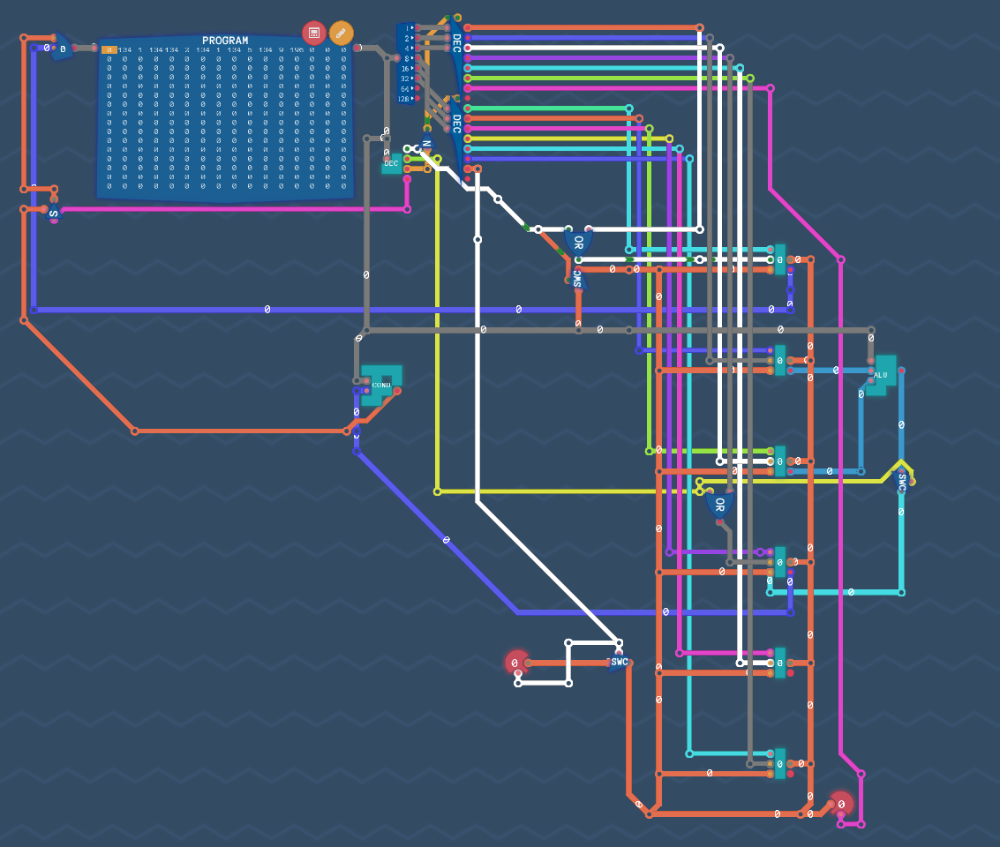

# 8 bit CPU emulator

This project emulates an 8 bit CPU using only logic gates and building upwards. All the operations are based on the underlying properties of the logic gates, and changing their operation leads to corresponding changes in function.  
 
 
 
Run maze_run.py to see the cpu control a robot in a maze. The robot sees one square ahead, and is controlled by the robot.asm program.  
Can you solve the maze?   
  

  
# Design

There are 6 registers, an input and an output. There is an ALU that can add, subract, and, or. We can also perform comparisons.

#### Code
Move a value into reg0.
```
0  # move 0 into reg0   
36 # move 36 into reg0
```   
Note that the 2 MSB must always be false, so the max value is 63

Arithmetic  
The operands are always reg1 and reg2 and the output is stored in reg3.
```
add  
or
and
sub
```
Copy
```
copy 0 6 # copy from reg0 to output
copy 5 3 # copy from reg5 to reg3
```
Eval  
Evaluates reg3 against a condition, if true sets the program counter to the value in reg0.
USES SIGNED NUMBERS
```
eval always
eval never
eval =
eval !=
eval < 
eval <=
eval >
eval >=
```  
Labels can be defined to be used as jumping points.    
```
label start     #create a label
34              # put 34 in reg0
copy 0 1        # move 34 to register 1
12              #put 12 in reg0
copy 0 2        # move to reg2
add             #add 12 and 34, store in reg3
start           # put start in reg0
eval =          # if the value in reg3 is = 0 then program counter is set to value start
```

